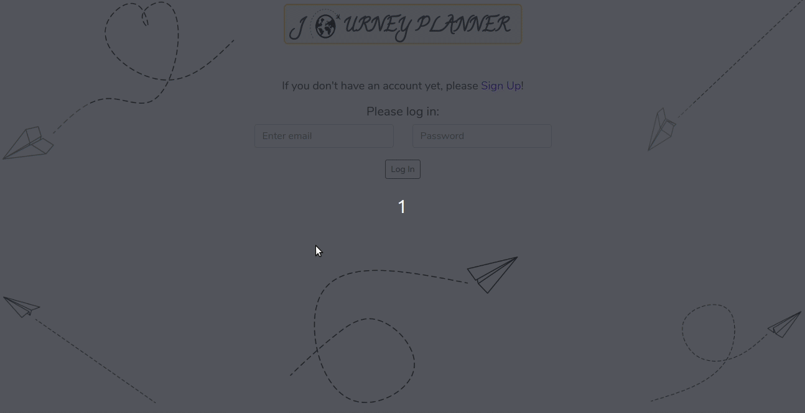

# Journey Planner - Client

## What this project is about

This project is a result of a Hackathon, where the challenge was to use at least one technology, that was not taught throughout the Code Academy course, by Codaisseur.
The Hackathon's theme was travel.

This is a journey planner application's server side, where a registered user can access the site's features, which are:

- creating journeys with name, date and destination country
  - creating events for each journey, that are displayed on a timeline
  - creating an editable packing list for each journey
  - getting useful info about the destination country
- deleting existing journeys
- deleting existing events

This project contains the end points and database models.

Link to client side:

- **[Client](https://github.com/adeltancsik/client-journey-planner)**

## Table of contents:

- **[How to install](#how-to-install)**
- **[Features built so far and the routes](#features-built-so-far)**

## How to install

1. Clone the git repository
   `git clone git@github.com:adeltancsik/server-journey-planner.git`

2. cd into the folder server-journey-planner

3. Run npm install and before launching the app (I recommend it with nodemon), please make sure that your docker container is up and running.

4. Run nodemon index. The app runs in the development mode on http://localhost:4000 in the browser.

5. Checkout the **[Client ReadMe](https://github.com/adeltancsik/client-journey-planner)** to install and run the client.

## Features built so far

